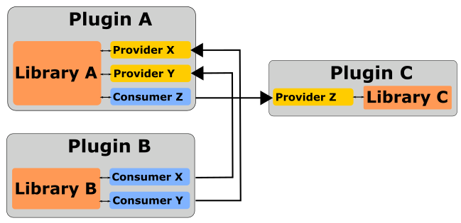

<a id="top"></a>
# CPPPS

1. [Overview](#overview)   
2. [Basic framework](#basic-framework)  
	2.1. [Consumers and providers](#consumers-and-providers)  
	2.2. [Application](#application)  
	2.3. [Plugin life cycle](#plugin-life-cycle)   
3. [Installation and linking](#installation-and-linking)  
	3.1. [Requirements](#requirements)  
	3.2. [Precompiled packages](#precompiled-packages)  
	3.3. [Compiling](#compiling)  
	3.4. [Use as a submodule](#use-as-a-submodule)  
4. [Examples](#examples)  
5. [Additional notes](#additional-notes)  
6. [TODO](#todo)

## Overview

The cppps library provides a C++17 plugin system that uses directed graphs to automatically build and analyze dependency trees.

The motivation was to provide a library facilitating the creation of modular monoliths. It's a helper library used in the main (assembly) component to dynamically load modules and track dependencies based on the functionality provided rather than its origins. In other words, you can remove and add plugins without referring to specific files as long as the required services are provided. 

 [Back to top](#cppps)

## Basic framework

None of your functional code should depend on the plugin loader. `cppps` was designed to be used at the component assembly level, and its classes are meant to help you attach your libraries to the main application using small adapters. Use it as a tool that makes it easier to follow SOLID guidelines and implement design patterns with loose coupling.

Consider writing a simple relay controller that turns relays on or off depending on sensor readings. If you were to break it down, you would probably have business logic that depends on the abstractions finally implemented, for example, by the `UsbRelay` and `I2cSensors` libraries. Linking shared libraries will force you to explicitly use files (like `libusbrelay.so`), while using e.g. raw `dlopen` calls will tie the implementation to a specific plugin. 

With `cppps`, you will cover the actual libraries with providers and consumers within a small plugin class. The provider will provide a pre-made object or a factory, and the consumer will fetch such a resource from the registry. Then, replacing e.g. `UsbRelay` with `NetworkRelay` or `SystemTimeSource` with `NtpTimeSource` won't be noticed by the rest of the application, regardless of whether the underlying library or the whole plugin changes.

 [Back to top](#cppps)

### Consumers and providers

The concept described above can be illustrated as follows:  




The plugin system will construct one or more directed graphs and initialize them in the correct order. In the example above:  


Having at least one unsatisfied consumer (without a provider) will result in an exception being thrown. Introducing a circular dependency also throws an exception. Using lots of providers and consumers in one plugin can cause circular dependencies even where in theory everything could still work. In such cases, it is recommended to simply isolate the resources as separate plugins. Future versions of this library will probably introduce some handy flags for this occasion.

Example provider code, sharing `product` object under "product" name, that is an instance of `Product` class:

```
void Plugin::submitProviders(const SubmitProvider& submitProvider) override
{
  submitProvider("product", [this](){return product;});
};
```

Example consumer code:
```
void submitConsumers(const SubmitConsumer& submitConsumer) override
{
  submitConsumer("product", [this](const Resource& resource){
    product = resource.as<IProductPtr>();
  });
};
```
Here, just for illustration, the `Product` class implements the `IProduct` interface (and the `IProductPtr` is an alias for `shared_pointer<IProduct>`).

Please see the minimal example in the `examples` directory.

[Back to top](#cppps)

### Application

A minimal program utilizing the application class might look like this:

```
#include <cppps/dl/Application.h>

int main(int argc, char *argv[])
{
  const cppps::AppInfo info {
    .appName = "MyApp",
    .appDescription = "cppps example app",
    .appVersionPage = "MyApp v1.0.0-rc3"
  };

  cppps::Application app(info);
  app.setPluginDirectories({app.getAppDirPath() + "/plugins", "/usr/lib/myapp/plugins/"});
  return app.exec(argc, argv);
}
```

One can also extend or wrap the Application class. Please see the minimal example in the `examples` directory. More examples hopefully coming soon.

[Back to top](#cppps)

### Plugin life cycle
Each plugin must implement the `IPlugin` interface. Life cycle methods to be overridden:

`prepare` - called right after loading, gets a handle to the CLI and application objects; here you should add the application arguments visible on the help page.

`submitProviders` - providers registration.

`submitConsumers` - consumers registration.

`initialize` - plugin initialization; it is guaranteed that this method will only be called when all consumers are matched with their providers.

`start` - called when all the plugins have been initialized.

`stop` - called on application quit event.

`unload` - called just before deleting plugin object. 

[Back to top](#cppps)

## Installation and linking

### Requirements

All third-party libraries have been included in the repository (see copyright notice and the "submodules" directory). The library itself uses C++17 standard library only. Boost can be used optionally (see [Additional notes](#additional-notes)). Building requires CMake (>=3.16) and essential C++17 build toolchain.

[Back to top](#cppps)

### Precompiled packages

Ubuntu builds are available to install via the PPA:

```bash
sudo add-apt-repository ppa:chodak166/ppa
sudo apt-get update
sudo apt-get install libcppps libcppps-dev
```

After the installation, you can link the target to `cppps-dl` (and `cppps-logging`). CMake projects can use the `find_package` directive, e.g. `find_package(CPPPS-DL 0.0.9 REQUIRED)` and link with `cppps::dl`. The package contains both static and shared build. Please see "examples/shared_logger" for details.

[Back to top](#cppps)

### Compiling

Manual build and installation:
```
git clone --recursive https://github.com/chodak166/cppps.git && cd cppps
mkdir build && cd build
cmake ..
cmake --build . --target install
```

[Back to top](#cppps)

### Use as a submodule

You can also use this repository as a submodule. Instead of using `add_subdirectory` directive, it is recommended to use `find_package` in MODULE mode. In your `CMakeLists.txt`:

```
list(APPEND CMAKE_MODULE_PATH "submodules/cppps/cmake/modules")
find_package(CPPPS-DL MODULE REQUIRED)
# ...
target_link_libraries(MyTarget cppps::dl)
```
Please see `examples/minimal` for details.

[Back to top](#cppps)

## Examples

The examples directory contains two very simple programs showing different scenarios for using the library. Both can and should be used as root cmake projects. The `minimal` example links to the same repository sources (cmake module) while the `shared_logger` example is thought to use an installed version of the library.

 [Back to top](#cppps)

## Additional notes

Since version 0.1.1 boost is optional, but you can still force the use of `boost::dll` instead of the cppps implementation by defining `CPPPS_DL_USE_BOOST`.

Many forks of this library have been used in production and smaller pet projects, but always on Linux. Although there is an implementation of the `cppps::WindowsPluginLoader` class, it is not in real use and may need patching. Just so you know.

 [Back to top](#cppps)

## TODO

- [ ] optional plugins flag
- [x] make boost optional
- [x] main loop injection into the application object
- [ ] dependency version matching policies
- [ ] static plugins
- [ ] easy access to resource registry from the main application

[Back to top](#cppps)
